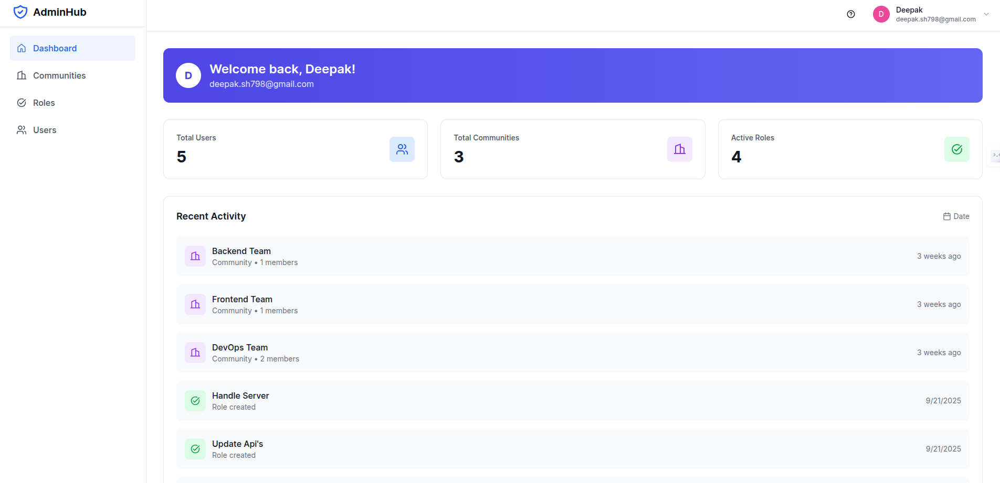
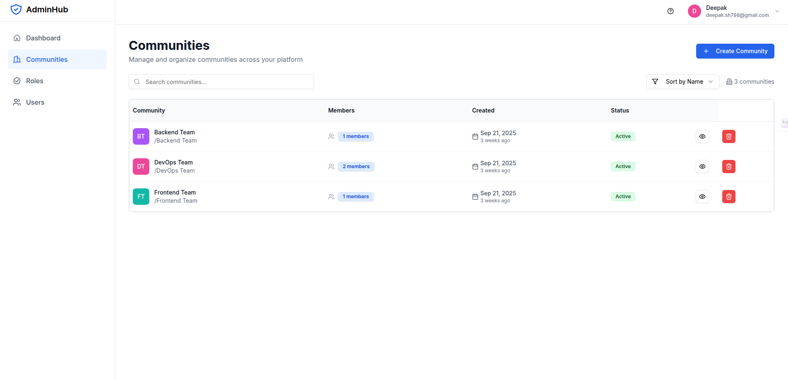
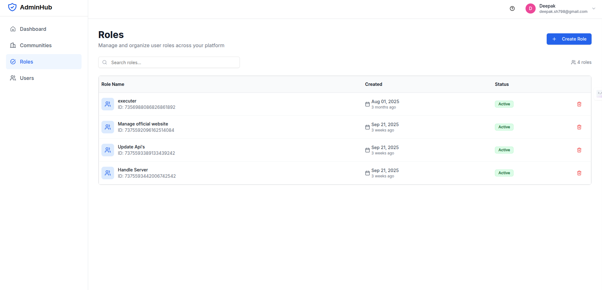
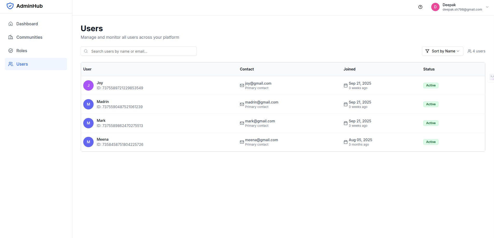

# AdminHub

AdminHub is a full-stack role-based access control (RBAC) web application where users can sign up, view a personal dashboard, create communities, define roles, add other users to their communities, and assign them roles.

The project demonstrates modern frontend and backend development using the MERN stack and focuses on authentication, community management, and clean UI/UX.

## 📸 Screenshots

### Dashboard View



### Community View



### Roles View



### Users View



## ✨ Features

- User Authentication (JWT + Bcrypt)
- User Dashboard with action history
- Community creation and management
- Role creation and assignment
- Add users to communities
- Protected routes and role-based access control

## 🛠 Tech Stack

### Frontend:

- Next.js
- TypeScript
- Tailwind CSS
- ShadCN UI

### Backend:

- Node.js
- Express.js
- MongoDB

### Authentication:

- JWT (JSON Web Token)
- Bcrypt for password hashing

---

### 6. **Environment Variables**

## 🔐 Environment Variables

Create a `.env` file in the `backend` directory with the following:

```env
PORT=5000
MONGO_URI=your_mongodb_connection_string
TOKEN_KEY=token_key
```

## Run Commands

### Backend

- npm install
- npm start

### Frontend

- npm install
- npm run dev
